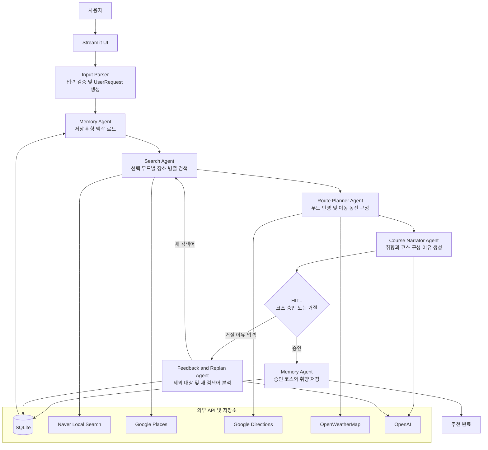

# 서울 데이트 코스 플래너

사용자가 선택한 서울 지역, 날짜, 시간대, 무드, 음식 취향을 바탕으로 데이트 코스를 추천하는 멀티 에이전트 프로젝트입니다.

선택한 무드마다 관련 장소를 최소 한 곳씩 코스에 포함하도록 검색하고, 이동 시간과 날씨를 반영합니다. 승인한 코스는 취향 DB에 저장되며 다음 추천의 Course Narrator 인사이트에 활용됩니다.

## 주요 기능

- 서울 25개 구 지도 선택
- 복수 시간대와 복수 무드 선택
- 오늘부터 이번 주 토요일까지 날짜 선택
- 오늘 날짜 선택 시 이미 종료된 시간대 자동 제외
- 선택 무드별 전용 장소 검색
  - 맛있는 거 탐방: 맛집, 레스토랑
  - 새로운 액티비티: 팝업스토어, 전시회
  - 쇼핑 & 거리 탐방: 편집샵, 쇼핑몰
  - 자연 & 힐링: 공원, 한강
  - 느긋한 카페 투어: 디저트카페, 베이커리카페
- 선택 무드별 장소 최소 1개 우선 포함
- 선택 지역 밖 검색 결과 제외
- Google Directions 이동 시간 및 OpenWeatherMap 날씨 반영
- 코스 장소 지도 핀 및 이동 경로 표시
- 장소 주소와 Google Maps 검색 링크 제공
- 별점·가격대·예상 비용은 조회하거나 표시하지 않음
- 코스 승인 시 장소 취향 학습
- 거절 이유를 LLM으로 분석해 새 장소를 검색하는 리플랜
- Naver Local Search 결과에서 새 취향 장소 선택
- 취향 직접 추가·수정·삭제 및 에이전트 실행 로그 제공

## 핵심 에이전트

현재 핵심 에이전트는 5개입니다.

| 에이전트 | 역할 |
|---|---|
| **Memory Agent** | SQLite에서 저장된 선호·비선호 취향을 읽고, 승인한 코스의 장소를 취향으로 저장 |
| **Search Agent** | Naver Local Search를 선택 무드별로 병렬 호출하고 Google Places로 장소 ID·영업 정보를 보강 |
| **Route Planner Agent** | 선택 무드별 후보를 최소 한 곳씩 우선 확보하고 이동 시간과 날씨를 반영해 코스 구성 |
| **Course Narrator Agent** | 이번 요청과 DB 저장 취향을 구분해 코스 구성 이유를 생성하고, 리플랜 시 피드백 반영 내용을 설명 |
| **Feedback & Replan Agent** | 승인·거절을 처리하고 LLM으로 제외 대상과 새 검색어를 분석해 다른 장소를 다시 검색 |

본 시스템은 Course Narrator Agent를 중심으로, Search Agent, Route Planner Agent, Memory Agent, Feedback Agent가 각각 검색, 동선 설계, 기억 관리, 피드백 처리를 담당하는 멀티 에이전트 구조로 설계되었습니다. OpenAI 모델은 **Course Narrator Agent**의 설명 생성과 **Feedback & Replan Agent**의 거절 이유 분석에 사용됩니다. Feedback 분석 호출이 실패하면 자주 쓰는 대체 표현을 처리하는 규칙 기반 분석으로 폴백합니다.


## 아키텍처 및 실행 흐름



초기 추천의 UI 실행 로그에는 다음 4개 에이전트가 표시됩니다.

```text
Memory → Search → Route Planner → Course Narrator
```

`Feedback & Replan`은 사용자가 코스를 거절했을 때만 조건부로 실행 로그에 추가됩니다.

## 후보 장소 선택 기준

1. Search Agent가 선택한 무드에 해당하는 전용 검색만 병렬 실행합니다.
2. `맛있는 거 탐방`을 선택했을 때만 음식점 후보를 검색하고, `느긋한 카페 투어`를 선택했을 때만 카페 후보를 검색합니다.
3. `먹고 싶은 것`과 `카페 스타일`은 관련 무드가 선택된 경우에만 검색 조건으로 반영됩니다.
4. 각 검색 결과에 어떤 무드에서 발견된 후보인지 `mood_tags`를 기록합니다.
5. Route Planner가 선택한 각 무드에 해당하는 장소를 최소 한 곳씩 먼저 선택합니다.
6. 음식점과 카페는 각각 최대 한 곳만 포함하고, 남은 자리는 액티비티 후보로 보충합니다.
7. 보충 장소는 이전 장소와의 이동 시간이 30분을 초과하면 제외합니다.
8. 무드 필수 장소는 무드 반영을 우선하기 위해 이동 시간이 30분을 넘어도 포함할 수 있습니다.
9. 특정 무드의 검색 결과가 전혀 없으면 UI에 포함하지 못한 무드를 경고합니다.

예를 들어 `맛있는 거 탐방 + 쇼핑 & 거리 탐방 + 새로운 액티비티`를 선택하면 맛집, 편집샵·쇼핑몰, 팝업스토어·전시회 검색 후보를 각각 최소 한 곳씩 우선 구성합니다.
쇼핑·액티비티 검색 결과에 음식점이나 카페가 섞여 나오면 후보 단계에서 제외하므로 여러 음식점을 연속 방문하는 코스로 빈자리를 채우지 않습니다.

## Course Narrator 동작

Course Narrator는 다음 정보를 함께 사용합니다.

- 이번 요청에서 직접 선택한 무드와 먹고 싶은 음식
- Memory Agent가 읽은 DB 저장 취향
- 최종 코스 장소와 순서

출력은 다음 흐름을 따릅니다.

```text
이번 요청에서 드시고 싶은 음식은 양식과 초밥이고, 선택한 무드는 맛집 탐방과 새로운 액티비티예요.
저장된 취향 기록을 보면 양식도 선호하셨어요.
그래서 이번 코스는 팝업스토어와 음식점을 차례로 방문하도록 구성했습니다.
```

Course Narrator는 이번 요청과 DB에 저장된 과거 취향을 서로 다른 문장으로 구분합니다. 저장된 취향이 없으면 그 사실을 명시하며, 없는 취향을 지어내지 않도록 프롬프트에 설정되어 있습니다. OpenAI 호출이 실패하거나 출력이 길이 제한으로 잘리면 동일한 구분을 유지하는 완결된 템플릿 설명으로 대체합니다.

## 피드백 기반 리플랜

리플랜은 기존 후보의 순서만 다시 섞는 방식이 아닙니다. 사용자가 거절 이유를 입력하면 다음 흐름으로 새로운 코스를 생성합니다.

```text
사용자 거절 이유 입력
  ↓
Feedback & Replan Agent
  현재 거절된 코스 + 피드백을 LLM으로 분석
  제외할 키워드와 새 검색어 추출
  ↓
Search Agent
  새 검색어로 Naver Local Search 재실행
  기존 코스 장소와 제외 대상 제거
  ↓
Route Planner Agent
  새 후보와 남은 후보로 동선 재구성
  ↓
Course Narrator Agent
  피드백을 반영해 다른 장소를 추천했다는 설명 재생성
```

예를 들어 `공원도 좋지만 이번에는 산을 가보고 싶어`라고 입력하면 `공원`을 제외 대상으로 처리하고 `산`, `등산`, `둘레길`을 새 검색어로 사용합니다. LLM 분석에 실패하거나 OpenAI 키가 없으면 자주 쓰는 표현을 처리하는 규칙 기반 분석으로 폴백합니다.

리플랜에서는 방금 거절한 코스의 장소를 다시 추천하지 않습니다. 구체적인 새 검색어를 추출하지 못한 경우에는 기존에 선택한 무드의 검색어로 새로운 후보를 다시 찾습니다. 최대 리플랜 횟수를 초과하면 날짜나 지역 변경을 안내합니다.

## 기술 스택

| 구분 | 기술 | 용도 |
|---|---|---|
| Language | Python 3.9+ | 에이전트 파이프라인, API 연동, 규칙 기반 계획 로직 |
| UI | Streamlit | 입력 폼, 실행 로그, 코스 출력, 취향 관리, HITL 승인·거절 |
| Map | Folium, streamlit-folium, Seoul GeoJSON | 서울 구 선택 지도, 코스 핀 및 경로 표시 |
| LLM | OpenAI API, `gpt-4o-mini`, `gpt-4o` | Course Narrator 설명 생성, Feedback 거절 이유 분석 |
| HTTP / Config | requests, python-dotenv | 외부 REST API 호출 및 `.env` 환경 변수 로드 |
| Parallelization | `ThreadPoolExecutor` | 선택 무드별 Naver 장소 검색 병렬 실행 |
| Storage | SQLite | 사용자 선호·비선호, 방문 기록, 승인·거절 피드백 저장 |
| Testing | pytest, pytest-mock | 외부 API Mock 테스트, 에이전트·도구·DB·UI 입력 규칙 검증 |

### 외부 API 및 저장소

| 구성 | 용도 |
|---|---|
| Naver Local Search | 음식점, 카페, 팝업, 전시, 쇼핑 후보와 주소·좌표 검색 |
| Google Places | 장소 ID·현재 영업 정보 보강, Naver 좌표가 없을 때 좌표 폴백 |
| Google Directions | 장소 간 대중교통 이동 시간 조회 |
| OpenWeatherMap | 선택 지역과 날짜의 날씨 안내 |
| OpenAI | Course Narrator 코스 설명 생성, Feedback & Replan 거절 이유 분석 |
| SQLite | 사용자 취향, 방문 기록, 승인·거절 피드백 저장 |

## 설치

### 1. 저장소 클론

```bash
git clone https://github.com/HannahKim/date-planner-agent.git
cd date-planner-agent
```

### 2. 초기 설정

```bash
bash setup.sh
```

`setup.sh`는 다음 작업을 자동으로 수행합니다.

- Python 가상환경 생성
- 필요한 패키지 설치
- `.env.example`을 복사해 `.env` 생성
- 비어 있는 SQLite 취향 DB 준비

처음 클론해서 실행하면 저장된 취향이 없는 상태로 시작합니다. 샘플 취향 데이터는 자동으로 추가되지 않습니다.

## API 키 발급

외부 검색·이동 시간·날씨·LLM 기능을 사용하려면 아래 API 키를 발급한 뒤 `.env` 파일에 입력해야 합니다. API 호출이 실패하면 가능한 범위에서 빈 결과, Naver 좌표, 규칙 기반 설명 등으로 폴백합니다.

### OpenAI API 키

Course Narrator가 코스 설명을 생성하고, Feedback & Replan Agent가 거절 이유에서 제외 대상과 새 검색어를 분석할 때 사용합니다.

1. [OpenAI API Keys](https://platform.openai.com/api-keys)에 로그인합니다.
2. `Create new secret key`를 선택합니다.
3. 생성된 키를 복사해 `OPENAI_API_KEY`에 입력합니다.

OpenAI API 사용을 위해 결제 설정이나 사용 가능한 크레딧이 필요할 수 있습니다.

### Naver Local Search API 키

음식점, 카페, 팝업스토어, 전시회, 편집샵 등의 장소 후보를 검색할 때 사용합니다.

1. [NAVER Developers 애플리케이션](https://developers.naver.com/apps/)에 로그인합니다.
2. `애플리케이션 등록`을 선택합니다.
3. 사용 API에서 `검색`을 선택합니다.
4. 비로그인 오픈 API 서비스 환경을 등록합니다.
5. 발급된 `Client ID`와 `Client Secret`을 각각 `NAVER_CLIENT_ID`, `NAVER_CLIENT_SECRET`에 입력합니다.

### Google Places 및 Directions API 키

Google Places는 장소 ID·영업 정보 보강과 Naver 좌표가 없을 때의 좌표 폴백에 사용하고, Google Directions는 장소 간 이동 시간 조회에 사용합니다. 새 취향 추가의 장소명 검색은 Naver Local Search를 사용합니다.

1. [Google Cloud Console](https://console.cloud.google.com/)에 로그인합니다.
2. 새 프로젝트를 생성하거나 기존 프로젝트를 선택합니다.
3. 프로젝트에 결제 계정을 연결합니다.
4. `API 및 서비스 → 라이브러리`에서 다음 API를 활성화합니다.
   - Places API (Legacy) (`maps/api/place/...` 엔드포인트 사용 권한)
   - Directions API
5. `API 및 서비스 → 사용자 인증 정보`에서 API 키를 생성합니다.
6. API 제한사항에서 `Places API`, `Directions API`만 허용합니다.
7. 로컬 개발 중에는 애플리케이션 제한사항을 `없음`으로 사용할 수 있습니다. 배포 환경에서는 서버의 고정 공인 IP 주소로 제한하는 것을 권장합니다.
8. `서비스 계정을 통해 API 호출 인증`은 선택하지 않습니다. 현재 앱은 Vertex AI나 Gemini API를 사용하지 않습니다.
9. 생성한 키를 `GOOGLE_PLACES_API_KEY`, `GOOGLE_DIRECTIONS_API_KEY`에 입력합니다.

같은 Google API 키를 두 환경 변수에 입력해도 되지만, 운영 환경에서는 API별로 키를 분리하고 제한하는 편이 안전합니다.
`REQUEST_DENIED`가 발생하면 Places API (Legacy) 활성화 여부, 결제 계정 연결, API 키의 `API 제한사항`, 서버 실행 환경에 맞는 `애플리케이션 제한사항`을 확인하세요. 브라우저 HTTP 리퍼러로만 제한한 키는 Python 서버 호출에서 거부될 수 있습니다.
Google Places 권한 거부가 한 번 확인되면 해당 앱 실행 중에는 반복 요청을 중단하고 Naver Local Search 좌표를 사용해 코스 생성을 계속합니다.

### OpenWeatherMap API 키

선택한 지역과 날짜의 날씨 안내를 생성할 때 사용합니다.

1. [OpenWeatherMap](https://openweathermap.org/)에서 계정을 생성합니다.
2. 로그인 후 [API Keys](https://home.openweathermap.org/api_keys) 페이지로 이동합니다.
3. API 키를 생성하거나 기본 발급 키를 확인합니다.
4. 키를 `OPENWEATHERMAP_API_KEY`에 입력합니다.

새 API 키가 활성화되기까지 잠시 시간이 걸릴 수 있습니다.

## 환경 변수 설정

프로젝트 루트의 `.env` 파일을 열어 발급받은 키를 입력합니다.

```env
OPENAI_API_KEY=sk-...
NAVER_CLIENT_ID=...
NAVER_CLIENT_SECRET=...
GOOGLE_PLACES_API_KEY=...
GOOGLE_DIRECTIONS_API_KEY=...
OPENWEATHERMAP_API_KEY=...
```

## 실행

```bash
# Streamlit UI
bash run.sh --ui
```

실행하면 브라우저에서 Streamlit 화면이 열립니다.

코드 변경 자동 감지와 Streamlit 개발자 툴바는 숨겨져 있습니다. 코드 수정 후 변경 사항을 반영하려면 실행 중인 앱을 종료하고 다시 실행합니다.

## 처음 사용하는 방법

처음 실행하면 저장된 취향이 없는 상태입니다. 취향 등록은 선택 사항이며, 등록하지 않고 바로 코스를 생성해도 됩니다.

1. 원하는 경우 화면 하단의 `취향 관리 → 새 취향 추가`를 엽니다.
2. `약수`, `성수`, `연남동 파스타`처럼 장소명 일부나 지역 키워드를 입력하고 `장소 검색`을 누릅니다.
3. Naver Local Search의 스크롤 가능한 검색 결과에서 장소명과 주소를 확인한 뒤 정확한 장소를 선택합니다.
4. 좋아하는 장소인지 별로인 장소인지 선택해 취향으로 저장합니다.
5. 지도에서 데이트할 서울 지역을 선택합니다.
6. 날짜, 시간대와 무드를 선택하고, 활성화된 경우에만 먹고 싶은 것과 카페 스타일을 입력합니다.
7. `코스 생성`을 누릅니다.
8. 추천 코스와 Course Narrator의 취향 기반 설명을 확인합니다.
9. 코스가 마음에 들면 승인해 다음 추천을 위한 취향으로 저장합니다.
10. 마음에 들지 않으면 거절 이유를 입력합니다. Feedback Agent가 이유를 분석하고 새 장소를 검색해 코스와 설명을 다시 생성합니다.

취향을 먼저 등록하면 Course Narrator가 저장된 취향과 이번 선택 조건을 함께 분석합니다. 취향을 등록하지 않은 첫 실행에서는 이번에 선택한 무드와 음식 취향을 기준으로 코스를 설명합니다.

`먹고 싶은 것`은 `맛있는 거 탐방` 또는 `느긋한 카페 투어` 무드를 선택했을 때만 입력할 수 있습니다. `카페 스타일`은 `느긋한 카페 투어`를 선택했을 때만 활성화됩니다.

날짜는 로컬 날짜 기준으로 오늘부터 이번 주 토요일까지만 선택할 수 있습니다. 오늘 날짜를 선택하면 이미 종료된 시간대는 목록에서 제외되고, 미래 날짜는 모든 시간대를 선택할 수 있습니다. 미래 날짜의 실제 영업시간은 방문 전에 Google Maps 링크에서 다시 확인하는 것을 권장합니다.

## Agentic Design Patterns

이 프로젝트는 에이전트 역할을 분리하고, 사용자 입력과 피드백에 따라 정해진 파이프라인을 실행합니다. 아래 표는 현재 코드에 실제로 적용된 패턴과 적용 목적을 정리한 것입니다.

### 적용된 패턴

| 패턴 | 적용 목적과 구현 |
|---|---|
| **Prompt Chaining** | 초기 추천은 `Memory → Search → Route Planner → Course Narrator`, 리플랜은 `Feedback 분석 → Search → Route Planner → Course Narrator` 순서로 이전 단계 결과를 다음 단계 입력으로 전달합니다. |
| **Routing** | 선택한 무드에 따라 맛집, 팝업스토어, 전시회, 편집샵 등 서로 다른 검색 쿼리로 라우팅합니다. 승인·거절 여부와 피드백 분석 결과에 따라서도 저장 또는 새 검색 흐름으로 분기합니다. |
| **Parallelization** | Search Agent가 `ThreadPoolExecutor`를 사용해 선택 무드별 Naver 장소 검색을 병렬 실행하여 검색 대기 시간을 줄입니다. |
| **Tool Use** | Naver Local Search, Google Places, Google Directions, OpenWeatherMap, SQLite를 각 에이전트가 목적에 맞게 호출합니다. |
| **Planning** | Route Planner가 시간대별 목표 장소 수, 선택 무드, 음식점·카페 개수 제한, 이동 시간 제약을 바탕으로 코스를 구성하며, 리플랜 시 새 후보로 다시 계획합니다. |
| **Multi-Agent System** | Memory, Search, Route Planner, Course Narrator, Feedback & Replan의 역할과 책임을 분리해 하나의 추천 흐름으로 연결합니다. |
| **Memory Management** | 승인 코스, 직접 등록한 선호·비선호, 피드백을 SQLite에 저장하고 최근 취향을 Course Narrator 입력 맥락으로 불러옵니다. |
| **HITL (Human-in-the-Loop)** | 사용자가 추천 코스를 승인하거나 거절하고, 승인 이유와 거절 이유를 직접 입력해 저장 및 리플랜 결과에 영향을 줍니다. |
| **Learning & Adaptation** | Feedback & Replan Agent가 사용자 거절 이유를 분석해 제외 대상과 새 검색 방향을 도출하고, 승인된 코스는 다음 추천을 위한 취향으로 저장합니다. |
| **Goal Setting & Monitoring** | 선택한 무드별 장소 최소 한 곳 포함 여부와 리플랜 횟수를 추적하고, 리플랜 상한을 넘으면 조건 변경을 안내합니다. |
| **Guardrails** | 지역·날짜 입력 검증, 최대 코스 장소 수, 장소 간 이동 시간 기준, 음식점·카페 최대 개수, 최대 리플랜 횟수를 제한합니다. |
| **Exception Handling** | 외부 API와 DB 작업 실패를 `try-except`로 처리하고 빈 결과나 기본값으로 폴백하여 앱 전체가 중단되지 않도록 합니다. |
| **Resource-Aware Optimization** | 장소 검색은 병렬 처리하고, LLM은 Course Narrator 설명과 Feedback 분석에만 사용합니다. Narrator는 템플릿으로, Feedback 분석은 규칙 기반 분석으로 폴백합니다. |

## 동작 확인 체크리스트

### 자동 테스트

```bash
bash run.sh --test
```

외부 API를 직접 호출하지 않고 입력 검증, 무드별 검색, 코스 구성, 피드백 분석, 리플랜 검색, 지도 좌표 선택, DB 저장 로직을 확인합니다.

## 현재 제한사항

- 팝업스토어·전시회처럼 운영 기간이 짧은 장소는 Naver Local Search 결과 품질과 최신성에 영향을 받습니다.
- 미래 날짜에는 현재 시각의 영업 여부로 장소를 제외하지 않습니다. 다만 선택 날짜와 시간대의 실제 영업시간은 방문 전에 Google Maps 링크에서 다시 확인하는 것을 권장합니다.
- 대중교통 이동 시간과 장소 상세 보강은 Google API 권한·할당량·결제 설정에 영향을 받습니다.
